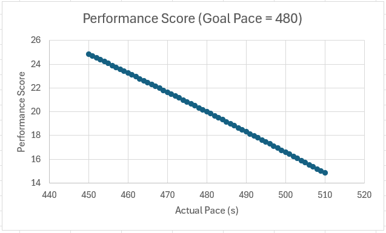

# TIR_Fantasy

Personal project with the goal to create a scoring system for the Texas Independence Relay (TIR).

# Performance Score
The performance score ($P$) is calculated using the following equation:

$$
P = D * (w_{s}S + w_{a}A )
$$

where

$$
\begin{align*}
    \text{Speed Score}\qquad S = \frac{\text{Goal Time}}{\text{Actual Time}} \\
\text{Pace Adherence} \qquad A = \left[1 - \left(\frac{\left|{\text{Actual Pace - Goal Pace}}\right|}{\text{Goal Pace}}\right)^2 + \left(\frac{\left|{\text{Actual Pace - Goal Pace}}\right|}{\text{Goal Pace}}\right)\right]\\
\text{Difficulty Score}\qquad D = \left(1 - \frac{\text{Rank - 1}}{36 - 1}\right) \times 10
\end{align*}
$$

This gives the general form of the performance score (up to a scaling constant):

The weights $w_{s}, w_{a}$ are predetermined to mainly favor reaching a goal pace. $\text{Rank}$ is metric ranging from 1 (hardest) to 36 (easiest) which indexes the difficulty of each race leg. Rankings are based on everything else being equal. So, neither the time of day (or which day) the legs are run, nor the weather is considered in the ranking. The largest factor is the length of the leg, followed by changes in elevation, and number of turns to navigate. 